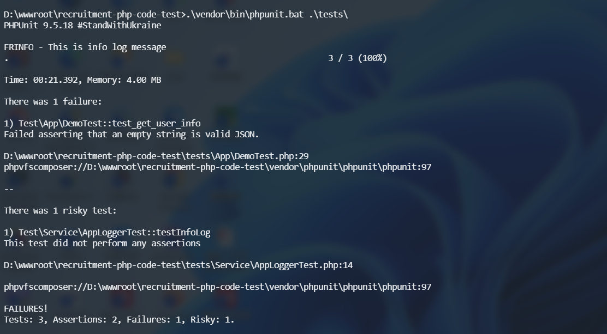

# recruitment-php-code-test

## 步骤

```shell
git clone https://github.com/akrick/recruitment-php-code-test.git
cd recruitment-php-code-test
composer install
#写一个App\Demo类的单元测试（文件名：tests/App/DemoTest.php）
#执行单元测试
./vendor/phpunit/phpunit/phpunit tests/App/DemoTest.php
```



